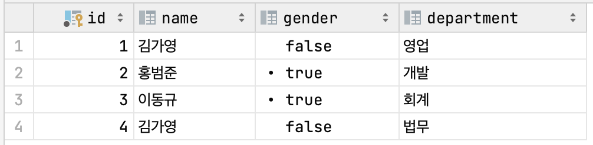

# AUTO_INCREMENT를 사용하는 이유

## 0. 들어가면서

최근에 이교준 강의자님의 Database 강의를 들으면서 RDB에 대한 공부를 하고 있다.  
지금까지 SQL이나 RDB를 사용한 적이 없는 것은 아니었지만, 그 때 그 때 구글링으로 조금씩 익힌 정도이지 딥하게 공부해 본 적은 없었다.

이번에 강의를 들으면서 가장 유익했던 점은 RDB에 대한 관점을 새롭게 가지게 된 것이다.  
별 생각 없이 사용해왔던 SQL 쿼리문들을 집합적인 개념을 바탕으로 바라볼 수 있게 되었고, 동시성 이슈에 대한 관점도 가질 수 있었다.

## 1. Primary Key

모든 데이터베이스 테이블은 primary key를 가져야 한다.  
primary key는 유일하게 특정 레코드를 식별할 수 있는 값으로, 다른 모든 칼럼의 값들을 결정하는 결정자로써의 역할을 한다.  
각 레코드를 식별할 수 있어야 하기 때문에 not null, unique 제약 조건이 적용된다.

예를 들어 다음 형태의 테이블이 있다고 가정해보자


EMPLOYEE 테이블에는 id가 primary key로 지정되어 있다.
primary key에는 not null 제약이 적용되기 때문에 다음과 같이 누락해서 데이터를 입력하면 에러가 발생한다.

```sql
insert into EMPLOYEE(id, name, gender, department) VALUES
    (null, '최신입', 0, '경영지원')

[에러 메시지] Column 'id' cannot be null
```

또한 unique 속성이 적용되기 때문에 기존에 존재하는 id를 사용해도 에러가 발생한다.

```sql
insert into EMPLOYEE(id, name, gender, department) VALUES
    (3, '최신입', 0, '경영지원')

[에러 메시지] Duplicate entry '3' for key 'employee.PRIMARY'
```

위 두 제약조건이 존재하기 때문에 primary key는 각 데이터를 유일하게 식별할 수 있다.

```sql
select * from EMPLOYEE where id = 1
```

## 2. Primary Key가 존재하는 이유

RDB에서 primary key가 반드시 존재하도록 제한한 이유는 무엇일까?

첫번째 이유는 각 테이블이 서로 관계를 맺게 하기 위함이다.  
관계형 데이터베이스의 각 테이블은 외래키를 이용하여 서로를 참조하고, 이를 통해 관계를 맺는다.  
이 때 외래키는 주로 상대 테이블의 primary key를 사용한다.

만약 primary key가 없다면 어떤 컬럼 값도 각 데이터를 유일하게 식별한다는 보장이 없고, 따라서 데이터의 참조 무결성이 깨질 가능성이 높아진다.

예를 들어, 위에서 정의한 EMPLOYEE 테이블과 관계를 맺는 RENT_LOG 테이블이 존재한다고 가정하자.  
어떤 직원이 차량을 렌트했는지를 기록하는 테이블이다.  
이 때 직원을 식별하는 값으로 name 칼럼 값을 사용한다고 해보자


김가영 직원이 렌트를 한 기록을 저장하기 위해 아래의 쿼리문을 사용할 수 있다.

```sql
insert into RENT_LOG(id, employee_name, car_name) VALUES
    (1, '김가영', 'K5')
```

이 상황에서 만약 김가영이라는 중복된 이름을 가진 직원이 새롭게 입사하여 EMPLOYEE 테이블이 아래와 같아졌다고 해보자.


이제 RENT_LOG에 남아있는 employee_name '김가영'이 어떤 직원을 식별하는지 알 수 없게 되었다.  
테이블 간 참조의 무결성이 깨진 것이다.

primary key의 경우에는 not null, unique 속성을 지키도록 database system에 의해 관리 받는다는 점에서 큰 이점이 있다.

## 3. AUTO_INCREMENT를 사용하는 이유

개발을 하다보면 primary key에 auto_increment 속성을 부여하는 경우가 많다.  
이러한 속성이 필요한 이유는 무엇일까?
