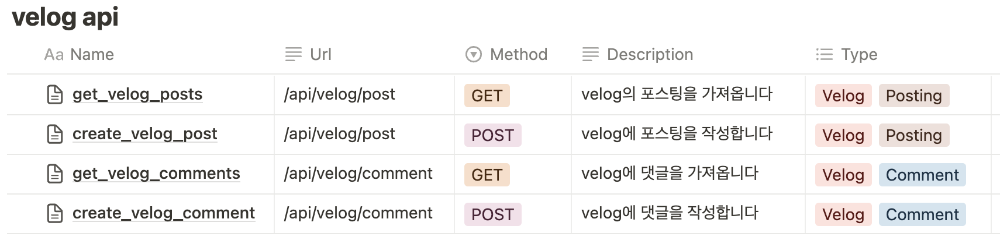
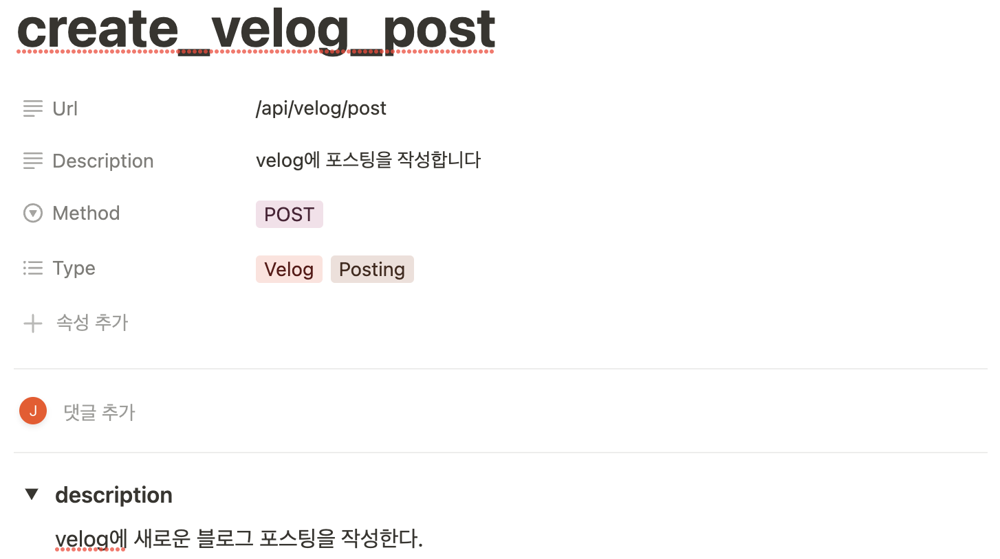
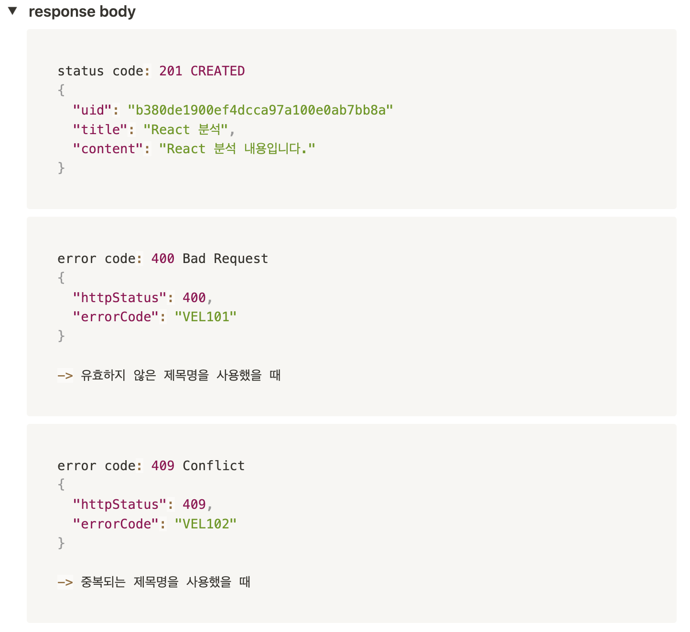
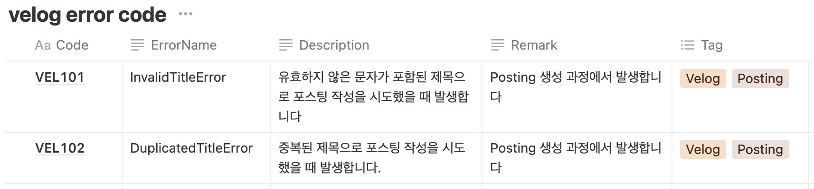

# 백엔드 개발 컨벤션 다지기

### 0. 시작하며

IT 회사가 있는 조직이라면 보통 개발 프로세스에 컨벤션이 존재해서, 일부 문서들은 작성하는 것이 필수로 정해져있다.  
백엔드 / 프론트엔드가 나뉘어 있는 조직이라면 직군 간 소통을 위해 적어도 API 문서 정도는 필수로 작성하게 된다.  

하지만 그건 큰 기업들에 해당 하는 것이고... 규모가 작은 조직에서는 이런 부분이 미흡할 수 있다.  
스타트업 초기에는 빠른 성장이 우선이기 때문에 문서화나 컨벤션 정립은 후순위로 밀릴 것이다.  
따라서 이 문제도 성장을 위한 일종의 부채라고 볼 수 있다.  


실제로 내가 경험했던 조직도 마찬가지였다.  
오랜 기간 풀스택 개발자가 개발을 해왔고, 따라서 문서화의 필요가 낮았다.  
이로 인해 남겨져 있는 문서가 매우 부족한 상태였고, 새로운 API도 문서가 없는 상태로 계속 추가되고 있었다.  

이번에 새로운 프로젝트에 추가되면서, 새롭게 구현하는 API들부터 컨벤션을 적용해보자고 마음 먹게 되었다.  

### 1. 요구 사항
당시의 요구 사항은 아래와 같았다.  
``` bash
1. 프론트 / 백엔드로 역할을 구분해서 구현
2. 웹 - 서버가 에러 메시지 없이 코드로만 에러 응답을 주고 받음
3. 서버 내에서 외부 API 사용 -> API 테스팅이 필요
4. 유연하게 역할 변경이 가능
```

### 2.1. 역할 구분을 위한 API 문서
#### 프론트 / 백엔드로 역할을 구분해서 구현
당시 조직은 풀스택 개발자들 위주로 구성되어 있었지만, 프론트엔드 / 백엔드 중에서 지향하는 스택은 서로 다른 상태였다.  
새로운 프로젝트를 하는 김에 피쳐 단위로 태스크를 나누기 보다는, 각자 원하는 스택으로 역할을 나눠서 구현하기로 했다.  

이렇게 역할을 나누기 위해서는 API 문서가 필수였다.  
API 스펙을 정의한 API 문서가 각 직군 사이의 소통 단위가 되어서, 추가적인 소통 없이 문서 공유 만으로 처리가 가능하길 원했다.  

swagger 등의 문서화 도구를 사용하는 것도 좋은 선택이었겠지만, 당장 어떤 도구를 도입하기 위해서는 팀 내 논의가 먼저 거쳐야만 했다.  
빠르게 시험적으로 도입하기 위해, 일단은 노션에 API 문서를 작성하기로 결정했다.  

먼저 노션의 데이터베이스 기능을 이용해서 한 눈에 API 문서들을 볼 수 있게 테이블을 만들었다.

url, http method, 간단한 설명, 타입(태그)를 간단하게 확인할 수 있게 구성했다.  
'Name' 칼럼에 있는 각 페이지를 클릭하면 각 API의 문서를 확인할 수 있다.



API 문서의 상단에는 테이블에 입력한 값들이 기본적으로 확인된다.  
내부 내용으로 해당 API의 상세 설명과 request body에 들어갈 값이 입력된다.  
(GET 요청에서는 필요할 경우 query parameter가 함께 작성된다.)  
이해가 쉽도록 예시 데이터를 넣어두는 형식으로 작성했다.



그 밑에는 각 http 응답에 대한 response body의 형식을 작성해두었다.  
정상 응답과 에러 응답의 예시를 넣어서 해당 API를 통해 받을 수 있는 응답이 모두 담겨있도록 했다.


### 2.2. 에러 코드 정리 문서
#### 웹 - 서버가 에러 메시지 없이 코드로만 에러 응답을 주고 받음  
해당 프로젝트 구현에서 에러 메시지를 응답에 노출시키지 않아야 한다는 요구사항이 존재했다.  
커스텀해서 정의한 에러 코드만으로 에러 종류를 식별하고, 이를 이용해서 웹에 메시지를 보여주어야 했다.  
프론트엔드에서 에러 메시지를 식별하고 서버 단의 로깅 및 디버깅의 편의성을 위해서는, 각 에러 종류를 한 눈에 파악할 수 있는 문서가 필요했다.  

해당 에러 문서도 마찬가지로 노션에 작성하기로 했다.  
API 문서 작성과 마찬가지로 노션의 데이터베이스 기능을 이용해서 작성했다.
