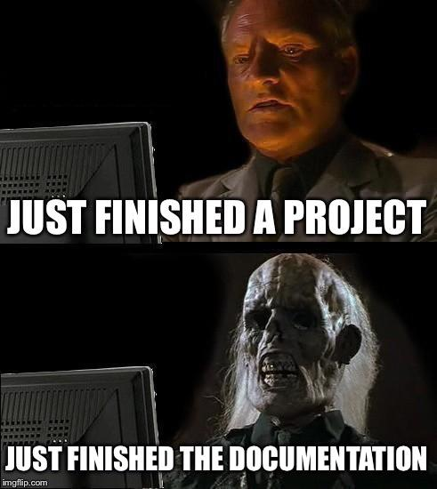

# 백엔드 개발 컨벤션 다지기

IT 회사가 있는 조직이라면 보통 개발 프로세스에 컨벤션이 존재해서, 일부 문서들은 작성하는 것이 필수로 정해져있다.  
백엔드 / 프론트엔드가 나뉘어 있는 조직이라면 직군 간 소통을 위해 적어도 API 문서 정도는 필수로 작성하게 된다.  

하지만 그건 큰 기업들에 해당 하는 것이고... 규모가 작은 조직에서는 이런 부분이 미흡할 수 있다.  
스타트업 초기에는 빠른 성장이 우선이기 때문에 문서화나 컨벤션 정립은 후순위로 밀릴 것이다.  
따라서 이 문제도 성장을 위한 일종의 부채라고 볼 수 있다.  

실제로 내가 경험했던 조직도 마찬가지였다.  
오랜 기간 풀스택 개발자가 개발을 해왔고, 따라서 문서화의 필요가 낮았다.  
이로 인해 남겨져 있는 문서는 매우 부족한 상태였고, 새로운 API도 문서가 없는 상태로 계속 추가되고 있었다.  

이번에 새로운 프로젝트에 추가되면서, 새로운 API들에 대해서부터 컨벤션을 적용해보자고 마음 먹게 되었다.